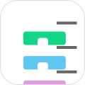
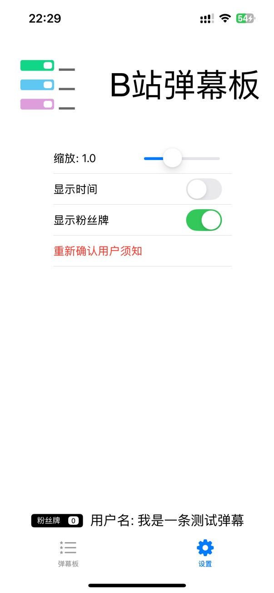

# B站弹幕板

查看B站直播间实时弹幕。

## 软件截图

<table>
<tr>
    <td> 
    <td> 
    <td> 
</table>

## TestFlight

当前iOS平台可在TestFlight中试用 https://testflight.apple.com/join/TzF1eU95

MacOS可从Action中下载

## 画饼（随缘更新）

### 基础功能

- [x] 添加README
- [x] 查看实时弹幕和礼物
- [ ] 保存收到的弹幕记录到本地，并按直播间区分
- [ ] 历史弹幕查询

### MacOS体验

- [ ] 优化MacOS使用体验

## 用户须知

您好，非常感谢您下载本软件，请您阅读并接受以下内容：

1. 本软件旨在为主播提供一个即时直播弹幕的看板，仅限个人用于查看自己直播间弹幕使用

2. 请勿滥用，因使用不当造成的任何影响由使用者自行承担，开发者不对因使用本工具而产生的任何版权纠纷或法律责任承担责任

3. 因B站限制，匿名状态无法正常获取弹幕，请您在同意后，使用B站客户端扫码登录，您的登录信息会储存在设备本地，在下次打开软件时会自动登录

4. 受网络状况等影响，请以官方直播间弹幕为准

## 致谢

https://github.com/komeiji-koishi-ww/bilibili_danmakuhime_swiftUI/
